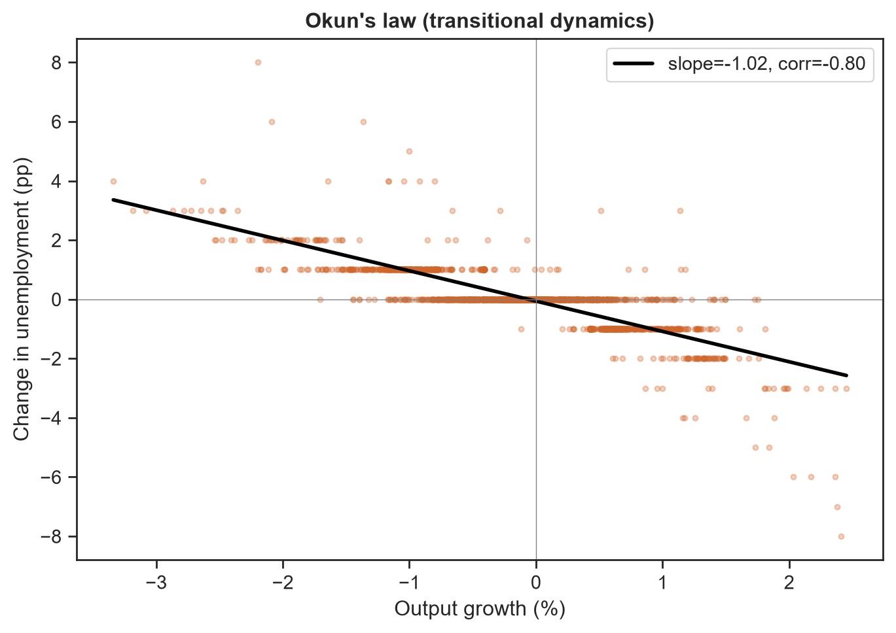

# Endogenous Investment, Unemployment and Capital Accumulation in a Heterogeneous Keynesian Agent-Based Model

## Overview

This repository contains an Agent-Based Model (ABM) built in Python with the
**Mesa** framework. It extends the heterogeneous Keynesian Cross of **Teglio
(2024)** with an endogenous investment mechanism, a **labour market with
unemployment**, and a minimal government that pays a balanced-budget
unemployment benefit.

The economy is a single-good, fixed-price, **stock-flow-consistent** circular
flow of income: every unit of money that leaves a household as spending is
received by a firm as revenue and paid straight back out as wages, dividends or
fiscal transfers, so the aggregate money stock is conserved (checked in the test
suite). The model is an exploratory computational laboratory for the
*qualitative* macroeconomics of alternative behavioural assumptions, not a
calibrated forecast.

---

## Research question

> **Can endogenous investment financed through accumulated private savings
> mitigate demand-constrained stagnation in a heterogeneous Keynesian economy?**

**Short answer from the model: yes.** Without investment the economy is trapped
in high unemployment *with idle capital* — firms will not hire because they
cannot sell. Deploying accumulated savings into investment recycles demand and
equips new jobs, driving unemployment from roughly **49% down to near zero**,
roughly **doubling output**, and lowering **income** inequality. The mitigation
is conditional: it needs an idle savings stock to deploy and requires that the
spending re-enter the income stream.


---

## The mechanism in four parts

**1. A persistent demand leakage (the thing to be mitigated).**
Capitalists have a much lower propensity to consume than workers, so they
persistently save out of dividend income (Kaldor–Kalecki class saving). With no
outlet, those savings accumulate as an idle money hoard, a leakage from the
circular flow of income.

**2. A labour market with unemployment.**
Firms employ only as many workers as they expect to need. Weak demand therefore
shows up as **unemployment**: workers are laid off *even while spare capital sits
idle*. The unemployed lose their wage and cut consumption, which deepens the
demand shortfall — the Keynesian multiplier working in reverse.

**3. Endogenous investment (the proposed remedy).**
Each period a capitalist converts a fraction `theta` of the accumulated savings
in that hoard into capital goods for the firm they own. This raises demand (more
hiring) *and* equips new jobs (a Leontief capital constraint on employment), so
it relaxes both constraints on employment at once.

**4. A balanced-budget automatic stabiliser.**
A flat income tax funds an unemployment benefit; the tax rate adjusts so the
budget balances each period. It is a pure transfer, so it puts a floor under the
consumption of the unemployed without creating or destroying money.

---

## Model equations

**Production** is Leontief: one employed worker makes `A` units of the good, and
a job must be backed by `kappa` units of capital, so a firm can staff at most
`K / kappa` jobs.

```text
output      = A * employed
max jobs    = K / kappa            (capital equips jobs)
```

**Employment** is chosen from adaptive (last-period) demand expectations, capped
by capital:

```text
desired employment = min( expected_demand / A , floor(K / kappa) )
```

**Income distribution.** With the price as numeraire, revenue equals goods sold.
The wage rate is `w = A / (1 + markup)`, so at full utilisation the wage share is
`1/(1+markup)` and the profit share is `markup/(1+markup)` — but only *employed*
workers receive a wage; the unemployed do not.

**Consumption** (worker MPC `c1`, lower capitalist MPC; wealth effect `lambda`):

```text
C = c0 + mpc * income + lambda * wealth        (bounded by money on hand)
```

**Investment** out of the accumulated savings hoard, with a capacity accelerator:

```text
I = theta * hoard * utilisation_effect
hoard              = max(0, money_wealth - precautionary_buffer)
utilisation_effect = max(0, 1 + sensitivity * (capital_utilisation - target))
```

**Capital** accumulation with depreciation `delta`, a one-period gestation lag,
and a floor (basic infrastructure that is never fully scrapped):

```text
K(t+1) = max( capital_floor , (1 - delta) * K(t) + I(t) )
```

**Government** (balanced budget): benefit `= rho * w` per unemployed, funded by a
flat tax whose rate clears `tax * income_base = benefits`, capped at `max_tax`.

---

## Simulation sequence

Each period runs in a fixed order so the real and monetary flows settle
consistently:

0. firms update capital (install last period's investment, depreciate);
1. firms plan desired employment from expected demand (capped by capital);
2. the labour market fires excess workers and fills vacancies (random matching);
3. households form consumption demand;
4. capitalists plan investment demand;
5. firms register demand, produce (subject to employed labour) and ration;
6. firms distribute revenue as wages and dividends;
7. the government runs the balanced-budget benefit;
8. households settle (credit income, pay for delivered goods);
9. capitalists settle investment (queue capital for next period).

---

## Recorded indicators

`Output`, `Potential_Output`, `Output_Gap`, `Unemployment_Rate`, `Employment`,
`Total_Capital`, `Capital_Utilization`, `Consumption`, `Investment`, `Tax_Rate`,
`Income_Gini` and `Wealth_Gini` (on net worth = money + owned capital).

---

## Results

Steady-state comparison (100 households, 10 firms, means over 20 seeds):

| Indicator            | Baseline `theta = 0` | Investment `theta = 0.15` |
| -------------------- | -------------------: | ------------------------: |
| Output               |                 ~50 |                       ~98 |
| Potential output     |                 ~70 |                      ~100 |
| Unemployment rate    |                ~49 % |                     ~1.5 % |
| Output gap           |                ~29 % |                      ~2 % |
| Capital stock        |                 ~35 |                      ~245 |
| Capital utilisation  |               ~0.73 |                     ~0.20 |
| Income Gini          |               ~0.25 |                     ~0.15 |
| Wealth Gini          |               ~0.91 |                     ~0.90 |

The baseline's key signature is **high unemployment with capital utilisation well
below one**: idle capital proves the constraint is *demand*, not scarcity.
Investment lowers unemployment, raises output, and cuts **income** inequality
(more people earn a wage) — though **wealth** inequality stays high, since the
new capital is owned by the same capitalists.


**Validation.** During the adjustment path the model reproduces **Okun's law** —
a strong negative relationship between output growth and the change in
unemployment (correlation ≈ −0.8) — a regularity it was never fitted to.



Because employment is discrete and matching is random, outcomes now vary across
seeds (visible confidence bands), so the model genuinely exploits its
agent-based structure rather than collapsing to a representative-agent aggregate.

---

## Repository structure

```text
src/
├── agents.py        Firm, Household, Capitalist behaviour
├── model.py         MacroModel: sequence, labour market, government, metrics
└── experiment.py    Monte-Carlo runner, confidence bands, theta sweep
notebooks/
└── 01_Endogenous_Investment.ipynb   Baseline vs. investment, sweep, Okun's law
tests/
├── conftest.py
└── test_model.py    Stock-flow consistency, labour accounting, headline result
performance/
└── engine.cpp       Fast aggregate (representative-agent) sweep companion
requirements.txt
macro_results.png, theta_sweep.png, okun.png
```

---

## Getting started

```bash
python -m pip install -r requirements.txt

# reproduce the figures and analysis
jupyter nbconvert --to notebook --execute --inplace notebooks/01_Endogenous_Investment.ipynb

# run the checks (stock-flow consistency, labour accounting, economic result)
python -m pytest tests/ -q
```

Programmatic use:

```python
import sys; sys.path.append("src")
from experiment import run_experiment, summarize, theta_sweep

panel = run_experiment(theta=0.15, steps=500, seeds=30)  # multi-seed panel
band  = summarize(panel)                                 # mean + 95% CI per step
sweep = theta_sweep([0.0, 0.1, 0.2, 0.3])                # steady-state vs theta
```

The optional C++ companion is an **aggregate approximation** (not a bit-for-bit
port) that reproduces the same `theta -> output` comparative statics at compiled
speed:

```bash
g++ -O2 -std=c++11 performance/engine.cpp -o engine && ./engine
```

---

## Current limitations

The model still abstracts from endogenous prices, banking and credit, monetary
policy, firm entry and exit, wage bargaining (the wage rate is fixed), adaptive
expectations beyond a naive rule, and technological change. The government is
minimal (a balanced-budget benefit, no discretionary fiscal policy).

---

## Future development

Wage adjustment (a Phillips curve); credit and banking (endogenous money);
heterogeneous firm productivity with competitive selection; firm entry and
bankruptcy; endogenous business cycles from expectations and inventories;
empirical calibration; and global sensitivity analysis — all preserving the
existing stock-flow structure.

---

## References

Teglio, A. (2024). *Rationality, inequality, and the output gap: Evidence from a
disaggregated Keynesian Cross diagram.*
<https://link.springer.com/article/10.1007/s11403-024-00412-4>

Mesa: Agent-Based Modeling in Python — <https://mesa.readthedocs.io/>

---

## Disclaimer

An exploratory computational economics model for research and education. It
investigates the qualitative implications of behavioural assumptions within a
heterogeneous Keynesian framework; it is not a calibrated forecast or a policy
recommendation.
