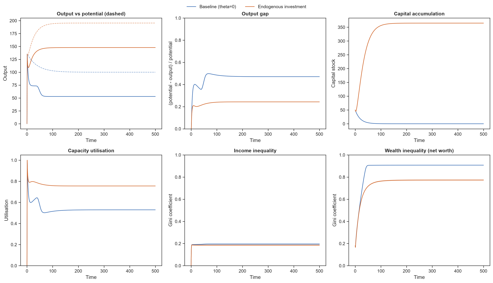
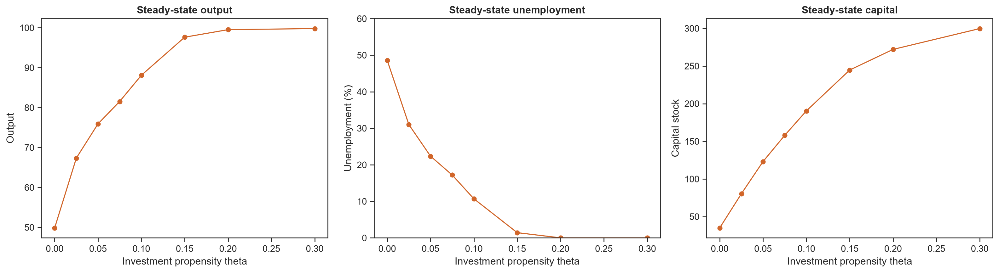

# Endogenous Investment and Capital Accumulation in a Heterogeneous Keynesian Agent-Based Model

## Overview

This repository contains an Agent-Based Model (ABM) built in Python with the
**Mesa** framework.  It extends the heterogeneous Keynesian Cross of **Teglio
(2024)** with an endogenous investment mechanism that turns accumulated private
savings into productive capital.

The economy is a single-good, fixed-price, **stock-flow-consistent** circular
flow of income: every unit of money that leaves a household as spending is
received by a firm as revenue and paid straight back out as wages or dividends,
so the aggregate money stock is conserved (checked in the test suite).  The
model is an exploratory computational laboratory for the *qualitative*
macroeconomics of alternative behavioural assumptions, not a calibrated forecast.

---

## Research question

> **Can endogenous investment financed through accumulated private savings
> mitigate demand-constrained stagnation in a heterogeneous Keynesian economy?**

**Short answer from the model: yes, substantially.** Moving from no investment
to a moderate investment propensity roughly **triples steady-state output**,
**halves the output gap**, sustains a positive capital stock, and **reduces both
income and wealth inequality**. The effect is conditional, it requires an idle
savings stock to deploy and that investment spending re-enter the income stream,
and it runs into diminishing returns as the economy approaches its (expanding)
capacity.



---

## The mechanism in three parts

**1. A persistent demand leakage (the thing to be mitigated).**
Capitalists have a lower marginal propensity to consume than workers, so they
persistently save out of dividend income (Kaldor-Kalecki class saving).  With no
outlet, those savings accumulate as an **idle money hoard**, a leakage from the
circular flow of income.  A small *wealth effect* (consumption out of wealth)
stops the baseline from collapsing to zero and instead pins it at a low
**stagnation** equilibrium in which output sits well below productive capacity.

**2. Endogenous investment (the proposed remedy).**
Each period a capitalist converts a fraction `theta` of the **accumulated
savings** in that hoard into capital goods for the firm they own.  This does two
things at once:

- **Demand channel (Keynesian).** The investment spending re-enters aggregate
  demand and is paid out as wages and dividends; it recycles the leakage.
- **Supply channel.** The purchased goods become productive capital (with a
  one-period gestation lag), raising future capacity.

An accelerator term tilts investment towards firms running above their target
utilisation and away from slack ones.

**3. Stock-flow-consistent settlement.**
Firms distribute 100 % of revenue and households only pay for goods actually
delivered (demand is rationed when a firm hits capacity).  This is what lets the
Keynesian "investment fills the saving gap" result *emerge* instead of leaking
away through inconsistent accounting.

---

## Model equations

**Consumption** (worker MPC `c1`, lower capitalist MPC; wealth effect `lambda`):

```text
C = c0 + mpc * income + lambda * wealth          (bounded by money on hand)
```

**Capacity** — capital-augmented labour productivity (*capital deepening*):

```text
Y* = A * L * (1 + gamma * (K / L) ** alpha)
```

Labour sets a positive floor `A * L`; capital *per worker* raises productivity
with diminishing returns (`alpha < 1`).  This is deliberately **not** a textbook
Cobb-Douglas `A K^a L^(1-a)`, which would force capacity to zero as capital
depreciates and make a demand-constrained baseline impossible to study.

**Output** is demand-constrained:

```text
Y = min(demand, Y*)
```

**Investment** out of the accumulated savings hoard:

```text
I = theta * hoard * utilisation_effect
hoard = max(0, money_wealth - precautionary_buffer)
utilisation_effect = max(0, 1 + sensitivity * (u - u_target))
```

**Capital** accumulation with depreciation `delta` and a one-period lag:

```text
K(t+1) = (1 - delta) * K(t) + I(t)
```

---

## Simulation sequence

Each period runs in a fixed order so spending, production, income distribution
and investment settle consistently:

1. households form consumption demand;
2. capitalists plan investment demand;
3. firms register the demand they face;
4. firms produce (subject to capacity) and the goods market rations;
5. firms distribute revenue (wages + dividends) and update capital;
6. households settle (credit income, pay for delivered goods);
7. capitalists settle investment (pay for delivered capital goods).

---

## Recorded indicators

`Output`, `Potential_Output`, `Output_Gap`, `Total_Capital`, `Consumption`,
`Investment`, `Total_Wealth`, `Income_Gini`, `Wealth_Gini` (on net worth =
money + owned capital) and `Average_Utilization`.

---

## Results

Steady-state comparison (100 households, 10 firms, means over 30 seeds):

| Indicator            | Baseline `theta = 0` | Investment `theta = 0.15` |
| -------------------- | -------------------: | ------------------------: |
| Output               |                 ~53 |                      ~148 |
| Potential output     |                ~100 |                      ~195 |
| Output gap           |                ~47 % |                     ~24 % |
| Capital stock        |                 ~0 |                      ~365 |
| Capacity utilisation |               ~0.53 |                     ~0.76 |
| Income Gini          |               ~0.19 |                     ~0.18 |
| Wealth Gini          |               ~0.91 |                     ~0.77 |

Sweeping the investment propensity `theta` (`theta_sweep.png`) shows output
rising and the output gap and wealth inequality falling, all at a **diminishing
rate** as the economy moves from demand-constrained towards capacity-constrained
territory.



---

## Repository structure

```text
src/
├── agents.py        Firm, Household, Capitalist behaviour
├── model.py         MacroModel: sequence, settlement, metrics
└── experiment.py    Monte-Carlo runner, confidence bands, theta sweep
notebooks/
└── 01_Endogenous_Investment.ipynb   Baseline vs. investment + sweep
tests/
├── conftest.py
└── test_model.py    Stock-flow consistency, determinism, headline result
performance/
└── engine.cpp       Fast aggregate (representative-agent) sweep companion
requirements.txt
macro_results.png, theta_sweep.png
```

---

## Getting started

```bash
python -m pip install -r requirements.txt

# reproduce the figures and analysis
jupyter nbconvert --to notebook --execute --inplace notebooks/01_Endogenous_Investment.ipynb

# run the checks (stock-flow consistency, determinism, economic result)
python -m pytest tests/ -q
```

Programmatic use:

```python
import sys; sys.path.append("src")
from experiment import run_experiment, summarize, theta_sweep

panel = run_experiment(theta=0.15, steps=500, seeds=30)  # multi-seed panel
band  = summarize(panel)                                 # mean + 95% CI per step
sweep = theta_sweep([0.0, 0.1, 0.2, 0.3])                # steady-state vs theta
```

The optional C++ companion is an **aggregate approximation** (not a bit-for-bit
port) that reproduces the same `theta -> output` comparative statics at compiled
speed:

```bash
g++ -O2 -std=c++11 performance/engine.cpp -o engine && ./engine
```

---

## Current limitations

The model deliberately abstracts from several mechanisms in order to isolate the
role of endogenous investment.  It does **not** yet include endogenous prices,
banking or credit, monetary or fiscal policy, firm entry and exit, an explicit
labour market with unemployment, adaptive expectations, or technological change.

---

## Future development

Heterogeneous firm productivity; endogenous markups; adaptive investment
expectations; an explicit labour market; firm entry and bankruptcy; empirical
calibration; wider sensitivity analysis; and robustness across alternative
network topologies, all preserving the existing stock-flow structure.

---

## References

Teglio, A. (2024). *Rationality, inequality, and the output gap: Evidence from a
disaggregated Keynesian Cross diagram.*
<https://link.springer.com/article/10.1007/s11403-024-00412-4>

Mesa: Agent-Based Modeling in Python - <https://mesa.readthedocs.io/>

---

## Disclaimer

An exploratory computational economics model for research and education.  It
investigates the qualitative implications of behavioural assumptions within a
heterogeneous Keynesian framework; it is not a calibrated forecast or a policy
recommendation.
