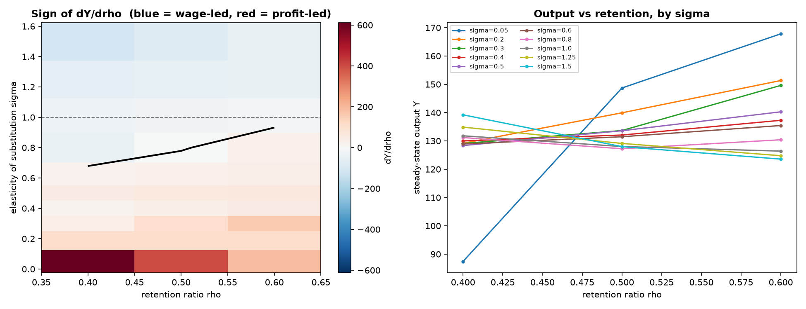
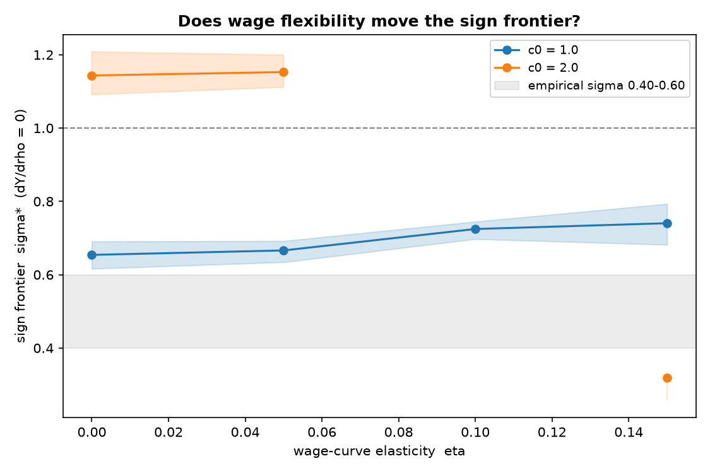
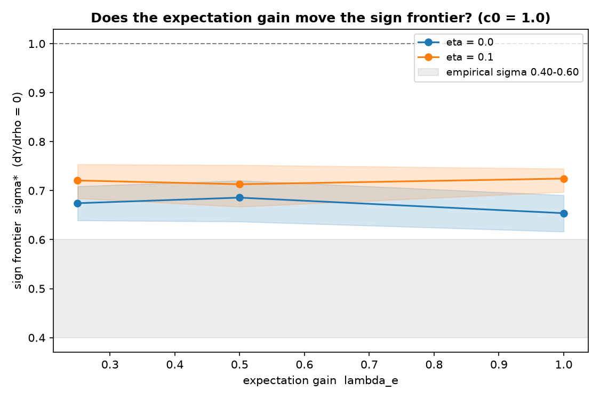
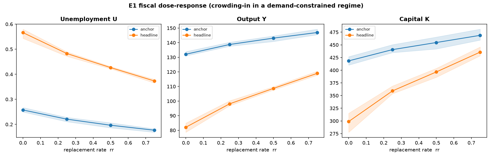
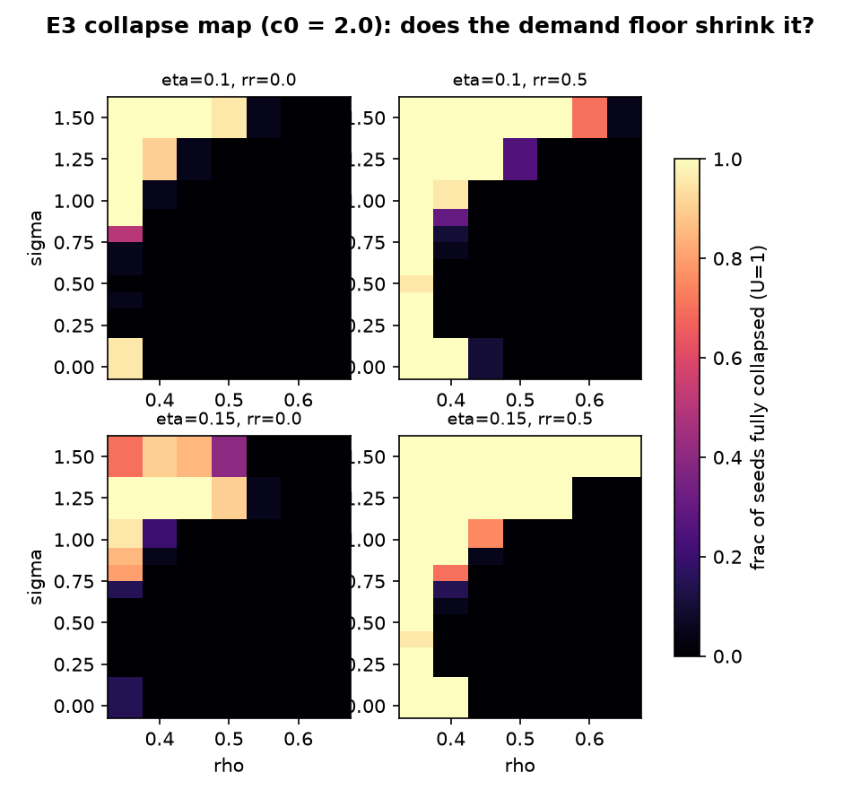
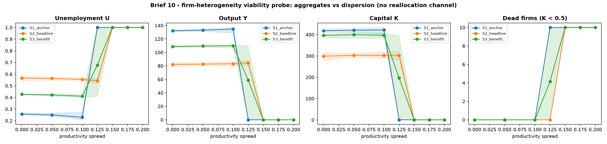
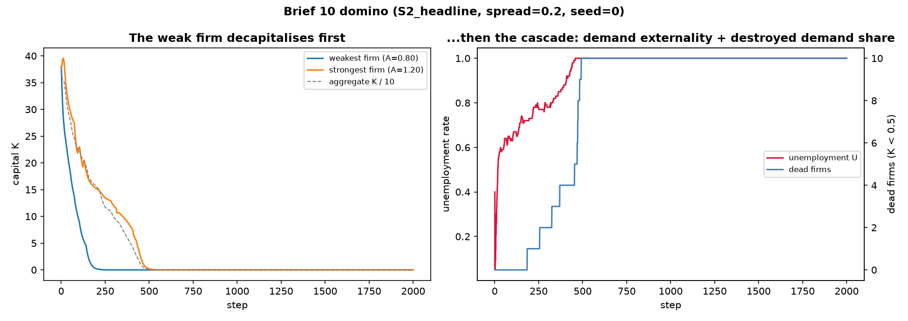
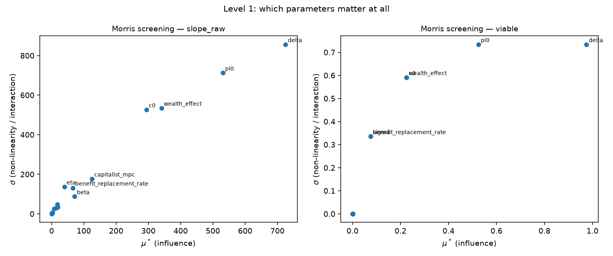
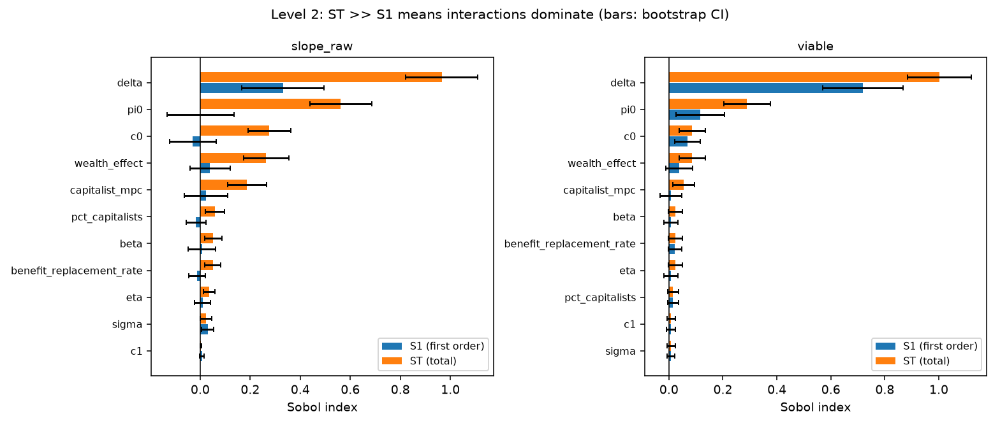
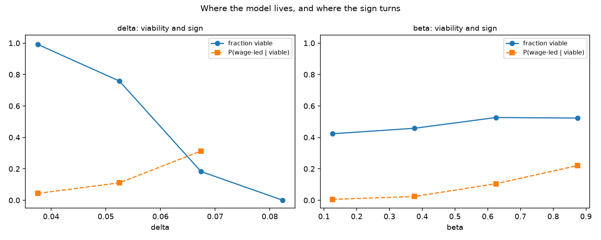

# Endogenous Investment and Capital Accumulation - a Normalised-CES Core with an Endogenous Labour Market

## Overview

This repository contains an Agent-Based Model (ABM) built in Python with the
**Mesa** framework. It extends the heterogeneous Keynesian Cross of **Teglio
(2025)** with **endogenous investment and capital accumulation**, so that both
sides of the economy are endogenous: a **demand** channel that works through
employment, and a **supply** channel that works through capital.

The economy is single-good, fixed-price (numeraire = 1) and
**stock-flow-consistent** (SFC): money is neither created nor destroyed in
settlement. It is an exploratory computational laboratory for the *qualitative*
macroeconomics of alternative behavioural assumptions, not a calibrated forecast.

Production is a **normalised CES** with elasticity of substitution `sigma`
(`sigma = 1` is the Cobb-Douglas core, `sigma -> 0` is Leontief); firms hire
**endogenously** at a wage `w_t` set by a Blanchflower–Oswald **wage curve** on
last period's unemployment (`eta = 0` fixes it at `w_bar` and recovers the
fixed-wage model exactly), and the unemployed earn nothing unless a minimal
**government** is switched on (brief 09: a balanced-budget unemployment benefit,
`benefit_replacement_rate = 0` by default) - so employment drives demand. `sigma`
governs the strength of capital–labour substitution, which is the mechanism that
decides whether the model is wage-led or profit-led.

---

## Research question

> **Can endogenous investment, financed internally by firms, drive output - and
> if so, does it do it by building capital (supply) or by paying wages (demand)?
> The answer depends on how easily capital substitutes for labour.**

The two channels pull in opposite directions:

* **Supply.** More retention `rho` → more investment → more capital → higher CES
  capacity. On its own this raises output.
* **Demand.** In a demand-constrained regime, more capital means *fewer workers
  needed for the same demand* (`L_demand` falls in `K`) → technological
  unemployment → the wage bill and the wage share fall → demand falls (workers
  have a higher marginal propensity to consume than capitalists).

Which dominates is the **wage-led vs profit-led** question, and its answer is set
by `sigma`. This is a research object, not a bug: **a wage-led outcome is a
result, not a failure.**

---

## Model

**Production - normalised CES (Klump & de La Grandville 2000):**

```text
Y* = Y0 * [ pi0*(K/K0)^r + (1-pi0)*(L/L0)^r ]^(1/r),   r = (sigma-1)/sigma
Y  = min(demand, Y*)
```

The base point `(K0, L0)` and base-point capital share `pi0` are the
**normalisation anchor**: a modelling choice, measured once at `sigma = 1`,
`rho = 0.40` and then **frozen** (`model.ANCHOR_K0`, `model.ANCHOR_L0`). `Y0` is
**derived** (`A*K0^pi0*L0^(1-pi0)`), never measured - this is what makes
`sigma = 1` reproduce Cobb-Douglas exactly. The normalisation is a *comparison
device* that makes the `sigma`-variants pass through the same point with the same
factor shares (so two economies differ *only* by `sigma`); it is **not** a claim
of causal identification (Temple 2012 - reported, not hidden).

**Endogenous employment - three limits (roadmap point 11):**

```text
L = min( L_demand, L_profitmax, N )
```

a firm hires the labour needed for expected demand, capped by the profit-max
point (where `MPL = w_bar`), capped by the workforce `N`. The cap `L <= N` is
what restores decreasing returns to capital - without it `L_profitmax` scales
with `K` and `Y*` becomes linear in `K` (an AK model with no steady state).

**Wage curve; profit is the residual:**

```text
w_t          = max( w_min, w_bar * (max(U_{t-1}, U_min)/U_REF)^(-eta) )   (brief 07)
wage_bill    = w_t * L
gross_profit = sales - wage_bill
```

The wage is set by a Blanchflower–Oswald **wage curve** on last period's
unemployment: a *level* relation (not a Phillips *change* relation), so it has a
well-defined steady state for every `U`. `eta = 0` fixes the wage at `w_bar` and
reproduces the earlier model **bit-for-bit**; `eta > 0` (empirical range
~0.07–0.10) lets the wage fall with unemployment. `U_REF` is the unemployment at
which `w = w_bar`, measured once at the anchor scenario and frozen; `w_min` is a
subsistence floor. The wage share is a **measured outcome**, structurally bounded
above by the `sigma`-dependent profit-max wage share (`1 - pi0` only at
`sigma = 1`).

**Internal financing via retained earnings:**

```text
util_effect = max(0, 1 + beta*(u_last - target_utilization))
I_planned   = clip(retention_ratio * profit_last * util_effect, investment_floor, profit)
retained    = I_planned
dividends   = gross_profit - retained
K(t+1)      = (1 - delta)*K(t) + I_delivered
```

The firm cash account (`money_buffer`) is an **intra-period pass-through** and
**returns to zero every period** - no money sequestration. **Conserved quantity
(SFC):** `sum(household wealth + income) + sum(firm money_buffer)` is constant
(deviation < 1e-9) - across the `pct_capitalists` range, not only at the default
(brief 12, §8).

**Ownership.** `int(num_households * pct_capitalists)` households are capitalists; firms
are assigned to them by cycling over the **firms**, so every firm has exactly one owner
at any `pct_capitalists` (which is what keeps the money circuit closed). A capitalist may
own several firms, or none - the latter is a low-MPC household on labour income alone, a
declared case.

**Consumption** (worker MPC `c1`, lower capitalist MPC, wealth effect `lambda`,
bounded by money on hand):

```text
C = c0 + mpc*income + lambda*wealth
```

---

## Period sequence

Read directly from `src/model.py`. Employment is set **before** households form
demand (expected income depends on employment); investment settlement precedes
household settlement.

0. **wage determination** (brief 07) - set `w_t` from the wage curve on *last*
   period's unemployment, before the labour market, to avoid the `w <-> U`
   simultaneity within a period (`eta = 0` short-circuits to `w_bar`);
1. **labour market** - firms plan employment, fire the excess into an unemployed
   pool, fill vacancies by random matching → employment;
2. households form consumption demand (income = wage if employed, else 0; plus
   dividends for capitalists);
3. firms plan investment (profit flow, accelerator on last utilisation);
4. firms register demand (consumption + investment);
5. firms produce `Y = min(demand, Y*)`; the goods market rations; utilisation is
   set against **profit-max** capacity;
6. firm accounting: wages, retained (= planned investment), residual dividends;
7. investment settlement: pay for delivered goods, update capital, return the
   residual as dividends so the buffer returns to zero;
8. **government** (brief 09) - a balanced-budget unemployment benefit: a flat tax on
   this period's accrued income funds an equal transfer to the unemployed, after the
   last income accrual and before settlement (`benefit_replacement_rate = 0` default
   skips it, reproducing the pre-brief-09 model bit-for-bit);
9. household settlement: credit income, pay for delivered goods.

---

## Results

All tables are means over **20 seeds**, **2000 steps**, last 50 observations;
`initial_capital = 40` fixed (it selects the basin - see *Interpretive frame*);
default parameters otherwise. Headline runs use `c0 = 1.0`. Numbers are read from
the committed outputs in `results/`, regenerated by `scripts/run_brief05.py`.

### 1. At `sigma = 1` (Cobb-Douglas) the economy is wage-led

Steady-state sweep over the retention ratio at `sigma = 1`, `c0 = 1.0`:

| rho  | Y     | K     | Employment | Unemployment | Wage share | Utilisation |
| ---- | ----- | ----- | ---------- | ------------ | ---------- | ----------- |
| 0.35 | 96.7  | 256.5 | 59.4       | 0.406        | 0.553      | 0.687       |
| 0.40 | 91.1  | 281.0 | 51.9       | 0.481        | 0.513      | 0.591       |
| 0.50 | 87.3  | 346.6 | 43.9       | 0.561        | 0.452      | 0.459       |
| 0.60 | 86.2  | 414.0 | 39.3       | 0.607        | 0.411      | 0.379       |
| 0.65 | 86.8  | 453.2 | 38.0       | 0.620        | 0.394      | 0.349       |

More retention builds capital (256 → 453) but **displaces workers** (employment
59 → 38, unemployment 0.41 → 0.62) and **lowers output** (96.7 → 86.8): the
capital–labour substitution channel dominates. This is the strongest possible
reconnection to Teglio's leakage mechanism - and it holds at exactly the `sigma`
the empirical literature rejects.


### 2. The sign of `dY/drho` depends on `sigma` - the sign frontier

`sigma*` is where the OLS slope of `Y` on `rho` (over the common viable support,
with a percentile bootstrap CI over 2000 resamples of the seeds) changes sign.
Below `sigma*`, retention raises output; above it, retention lowers output.

| `c0` | target | `sigma*` | 95% CI          | resamples with no sign change | P(`sigma*` > 0.60) |
| ---- | ------ | -------- | --------------- | ----------------------------- | ------------------ |
| 1.0  | Y      | 0.654    | [0.616, 0.691]  | 0 %                           | 99.8 %             |
| 1.0  | U      | 0.314    | [0.300, 0.325]  | 0 %                           | 0 %                |
| 2.0  | Y      | 0.941    | [0.918, 0.963]  | 0 %                           | 100 %              |
| 2.0  | U      | 0.450    | [0.444, 0.456]  | 0 %                           | 0 %                |

* **The empirical range `sigma` 0.40–0.60 (Chirinko 2008; Knoblach et al. 2020)
  sits *below* `sigma*`**, where `dY/drho > 0`: in the empirically supported
  region the model is **not** wage-led on output. The wage-led headline rests on
  `sigma = 1`, which sits *above* `sigma*` and which the data reject.
* **`dU/drho` has a *different* frontier** (`sigma*_U ~ 0.31–0.45`): in the band
  `sigma ~ 0.3–0.7`, output **and** unemployment rise together - growth with
  technological unemployment, which "profit-led" does not describe.



### 3. `sigma*` is a frontier, not a number

`sigma*` moves with what you condition on, and this is reported rather than
reduced to a point estimate:

* **with `rho`** (curvature): `Y(rho)` is significantly curved - the quadratic
  turning point falls inside the support in 19 of 22 `(c0, sigma)` cells, `|t|`
  up to 20.5. A single OLS slope is *precise and wrong*: it fits a line to a
  parabola.
* **with the support**: `sigma*` (c0 = 1.0) ranges from 0.46 (rho 0.35–0.55) to
  0.94 (rho 0.45–0.65).
* **with the anchor** (Temple 2012): moving the normalisation anchor from
  `rho = 0.40` to `rho = 0.50` shifts `sigma*(rho = 0.5)` from 0.84 to 0.64.

### 4. Wage flexibility does not overturn the wage-led result (the wage curve)

A critic can attribute the wage-led result to the *fixed* wage: it suppresses the
offsetting channel `U up -> w down -> labour cheaper -> substitution toward labour
slows`. Brief 07 turns that channel on with a wage curve (`eta` its elasticity)
and re-estimates `sigma*(eta)` on the support viable at **every** `eta` (so it is
comparable across `eta`). The counter-channel is already in the model and
Kaleckian: `w down -> wage bill down -> demand down` (the paradox of costs).
`eta = 0` reproduces the brief-05 `sigma*` **byte-for-byte** (nesting check PASS).

`sigma*(eta)` on `Y`, `c0 = 1.0` (support `rho` 0.35–0.65, fully viable at every
`eta`; means over 20 seeds, bootstrap CI over 2000 seed-resamples):

| `eta` | `sigma*` (Y) | 95% CI          | P(`sigma*` > 0.60) | mean `U` |
| ----- | ------------ | --------------- | ------------------ | -------- |
| 0.00  | 0.654        | [0.616, 0.691]  | 99.8 %             | 0.528    |
| 0.05  | 0.666        | [0.634, 0.692]  | 99.9 %             | 0.543    |
| 0.10  | 0.725        | [0.697, 0.745]  | 100 %              | 0.565    |
| 0.15  | 0.740        | [0.682, 0.793]  | 100 %              | 0.579    |

* **`sigma*` *rises* with `eta`**, moving *further above* the empirical range
  `sigma` 0.40–0.60. Turning on the substitution channel does **not** overturn the
  wage-led outcome at `sigma = 1`, which stays above `sigma*` at every `eta` tested:
  the Kaleckian demand channel dominates there.
  > **Wording corrected (brief 14).** This bullet previously said the rise in `sigma*`
  > "**reinforces**" the wage-led outcome full stop. It does so only for the `sigma = 1`
  > headline. For the *empirical* range the effect is the opposite: pushing `sigma*` from
  > 0.654 up to 0.740 moves 0.40–0.60 **deeper into the profit-led region**. Wage
  > flexibility does not rescue a wage-led reading of the empirically supported band -
  > it widens the band in which retention *raises* output. Same numbers, correct sign.
* **Wage flexibility does not auto-correct unemployment** - mean `U` *rises*
  (0.53 → 0.58) as `eta` grows. The paradox of costs, reported not recalibrated.



**Secondary regime `c0 = 2.0`: wage flexibility *destabilises* it.** The high-`sigma`
(1.25, 1.50), low-`rho` corner tips into collapse (`Y -> 0`, `U -> 1`) under wage
flexibility, spreading with `eta` (`sigma = 1.25`: 43 % of seeds collapse at
`eta = 0.15`). The strict common viable support shrinks from `rho` 0.40–0.65 to
0.50–0.65; on that support `sigma*` is erratic - **undefined** at `eta = 0.10` (the
sign never turns: wage-led at every `sigma` tested) and 0.32 at `eta = 0.15`. The
wage floor `w_min = 0.45` **never** stably binds anywhere, so this is genuine
viability collapse, not a floor artefact.

*Mechanism* (verified on a traced trajectory and a `sigma`-sweep at `c0 = 2.0`): the
wage **oscillates** - up above `w_bar` when `U -> 0` (the `U_min` guard sends
`w -> ~1.25`) and below it when `U` is high - and because `L_profitmax` grows more
wage-sensitive as `sigma` rises, this feeds a widening employment oscillation that
**erodes capital every cycle** (investment cannot cover depreciation) until, at low
`rho`, the economy collapses to `U = 1`. In the empirical region `sigma ~ 0.5` the
same curve leaves `w ~ w_bar`, no oscillation, and capital *grows*. The collapse is
capital erosion at high `sigma`, not a monotone upward wage spiral. Reported as a
finding, not recalibrated. Outputs: `results/ces_b07_*.csv` (via `scripts/run_brief07.py`).

### 5. Adaptive expectations do not move the frontier or the collapse (brief 08)

The headline results are comparative statics on the steady state, where `Ye = D` for
any expectation gain. Brief 08 generalises the firm's demand expectation from static
(`Ye_t = D_{t-1}`) to adaptive, `Ye_t = Ye_{t-1} + lambda_e*(D_{t-1} - Ye_{t-1})`,
and asks whether a slower expectation (a damper) changes *which* steady state is
selected, or shrinks the `c0 = 2.0` collapse. `lambda_e = 1` reproduces the committed
brief-05/07 panels **byte-for-byte** (4 nesting checks, `max_abs_dev = 0.0`).

`sigma*(eta; lambda_e)` on `Y`, `c0 = 1.0` (across-config common support `rho`
0.35–0.65; 20 seeds, bootstrap CI). The gain is **not** a lever: every point sits
within its neighbours' CIs.

| `eta` | `lambda_e` | `sigma*` (Y) | 95% CI          | P(`sigma*` > 0.60) |
| ----- | ---------- | ------------ | --------------- | ------------------ |
| 0.00  | 1.00       | 0.654        | [0.616, 0.691]  | 99.8 %             |
| 0.00  | 0.50       | 0.686        | [0.637, 0.721]  | 99.9 %             |
| 0.00  | 0.25       | 0.674        | [0.639, 0.709]  | 99.9 %             |
| 0.10  | 1.00       | 0.725        | [0.697, 0.745]  | 100 %              |
| 0.10  | 0.50       | 0.713        | [0.667, 0.752]  | 100 %              |
| 0.10  | 0.25       | 0.721        | [0.684, 0.754]  | 100 %              |

* **`sigma*` is `lambda_e`-invariant within CI.** The empirical `sigma` 0.40–0.60
  stays *below* `sigma*` for every gain, so the wage-led result and its brief-07 rise
  with `eta` are both **robust to the expectation gain**. No basin-selection finding.



**The stabilisation hypothesis is *not* confirmed (`c0 = 2.0`).** The falsifiable
guess was that a slower expectation damps the brief-07 wage-employment oscillation and
shrinks the collapse region. It does **not**: the collapse is `lambda_e`-invariant to
within grid/seed noise (cells with any collapse at `eta = 0.10`: 16/15/14 for
`lambda_e = 1/0.5/0.25`, but fully-collapsed cells flat at 6; non-monotone at
`eta = 0.15`), and the reference collapsing cell (`sigma = 1.5, rho = 0.40,
eta = 0.10`) collapses to `K = 0, U = 1` at **every** `lambda_e`. The `c0 = 2.0`
collapse is driven by the wage→`U`→capital-erosion channel, which `lambda_e` does not
touch: damping the *demand* expectation cannot stabilise an instability that does not
originate in demand. Reported as a finding. Outputs: `results/ces_b08_*.csv` (via
`scripts/run_brief08.py`).

### 6. A balanced-budget benefit crowds capital *in* where demand-constrained, but does not stabilise the collapse (brief 09)

The unemployed earn nothing, so every unemployed worker leaks entirely out of the
circular flow (their notional `c0` is unfinanceable at zero wealth). Brief 09 reinnests
the Leontief branch's **balanced-budget unemployment benefit** on the current core: a
flat tax on accrued income funds an equal transfer to the unemployed, indexed to the
current wage `w_t` (`benefit_replacement_rate` = rr its size; OECD net replacement rates
~50–80 % for a low earner - see `parameter_notes.md`). `rr = 0` reproduces the committed
brief-05/07 panels **byte-for-byte** (4 nesting checks, `max_abs_dev = 0.0`).

**E1 - fiscal dose-response (the balanced-budget multiplier crowds capital in).** At the
headline demand-constrained scenario (`c0 = 1.0, sigma = 0.5, eta = 0.10, rho = 0.40`):

| rr   | U     | Y      | K      | wage share | realised tax | cash-constrained |
| ---- | ----- | ------ | ------ | ---------- | ------------ | ---------------- |
| 0.00 | 0.566 | 82.1   | 298.8  | 0.440      | 0.000        | 0.90             |
| 0.25 | 0.483 | 98.1   | 359.2  | 0.446      | 0.128        | 0.90             |
| 0.50 | 0.427 | 108.7  | 396.6  | 0.452      | 0.206        | 0.90             |
| 0.75 | 0.373 | 119.0  | 435.7  | 0.457      | 0.250        | 0.90             |

Unemployment falls and - the theoretical point - both output **and capital rise**
(299 → 436): in a demand-constrained regime redistribution is **crowding-in** (more
demand → more profit → more investment via `I = rho*pi`). The `anchor` scenario
(`c0 = 2.0, sigma = 1`) moves the same way, more gently (U 0.257 → 0.177, K 418 → 469).
The **cash-constrained fraction stays 0.90 = all 90 workers, invariant to rr**: the
benefit never lifts a worker off the liquidity constraint (MPC ~ 1 is preserved), which
is exactly why the balanced-budget multiplier keeps delivering across the whole dose.

**E2 - the benefit eliminates the wage-led region (`c0 = 1.0`).** At rr = 0,
`sigma*(Y)` = 0.654 (natural anchor) / 0.83 (across-config support), wage-led for
`sigma` above it. At **rr = 0.5 `sigma*` is undefined** (`frac_undefined ~ 1.0`): every
`dY/drho` slope turns **positive** across the tested range (`sigma = 1`: +38.7;
`sigma = 1.5`: +19.3), pushing `sigma*` above 1.5. The demand floor makes retention
expansionary at **every** `sigma` - the wage-led high-`sigma` region is gone. The `U`
frontier barely moves (`sigma*_U ~ 0.40 → 0.43`): the benefit changes the *output*
response to retention far more than the *unemployment* response. (The brief expected a
*small* shift; the measured shift is large, and reported as such.)

**E3 - the stabilisation hypothesis is falsified: the collapse region *enlarges*
(`c0 = 2.0`).** The falsifiable guess was that a demand floor when `U` rises shrinks the
brief-07 wage-curve collapse. It does the opposite. Cells with any collapsed seed:
`eta = 0.10` **16 → 26** from rr = 0 to rr = 0.5; `eta = 0.15` **16 → 29**; the mean
fraction of seeds at `U = 1` doubles (0.125 → 0.266, 0.129 → 0.333). The reference cell
(`sigma = 1.5, rho = 0.40, eta = 0.10`) collapses to `K = 0, U = 1` at **both** rr = 0
and rr = 0.5, but at rr = 0.5 the tax is **pinned at the cap** (`Tax_Rate = 0.600`,
fraction of periods at cap = 1.0) - the instrument saturates and the economy still dies.
*Mechanism* (from the tax-saturation diagnostics `mean_tax`, `frac_periods_at_cap` now
in the collapse map and trace): where firms are collapsing the tax base is almost all
wages, so taxing workers to pay workers is **MPC-neutral** (no net demand); the benefit
indexed to `w_t` is **procyclical** (high `U` → low `w_t` → weak floor); and the demand
it does inject **amplifies** the wage→`U`→capital-erosion oscillation in the high-`sigma`
corner. A demand floor cannot stabilise a collapse that does not originate in demand -
it aggravates it. Reported as a finding, not recalibrated. Outputs: `results/ces_b09_*.csv`
(via `scripts/run_brief09.py`).




### 7. Why the firms are homogeneous - a structural assumption, tested (brief 10)

All ten firms share one productivity `A`. That is an **assumption**, and roadmap point 8
proposed relaxing it. Brief 10 does not implement it; it **measures what would happen if
it did**, and the measurement is the reason the point is closed rather than built. One
experimental dial, `productivity_spread`, fans the firm productivities out
mean-preservingly (`A_i = 1 + spread*(2i-(n-1))/(n-1)`), changing nothing else - no
selection, no demand reallocation, no entry/exit. `spread = 0` reproduces the committed
brief-05/07/09 panels **byte-for-byte** (3 nesting checks, `max_abs_dev = 0.0`).

The result is a **cliff, not a gradient**. Below the threshold the economy is healthy and
no firm dies; one grid step above it, *every* firm is dead:

| spread | S1 `anchor` U / Y | S2 `headline` U / Y | S3 `rr=0.5` U / Y | dead firms (S2) |
| ------ | ----------------- | ------------------- | ----------------- | --------------- |
| 0.000  | 0.258 / 132.1     | 0.566 / 82.1        | 0.427 / 108.7     | 0               |
| 0.050  | 0.250 / 133.0     | 0.563 / 82.7        | 0.421 / 109.5     | 0               |
| 0.100  | 0.229 / 134.7     | 0.554 / 83.2        | 0.410 / 109.9     | 0               |
| 0.125  | **1.000 / 0.0**   | 0.543 / 84.2        | 0.676 / 58.9      | 0               |
| 0.150  | 1.000 / 0.0       | **1.000 / 0.0**     | **1.000 / 0.0**   | **10**          |
| 0.200  | 1.000 / 0.0       | 1.000 / 0.0         | 1.000 / 0.0       | 10              |

"Collapsed" is literal: `Y = 0`, `U = 1`, all ten firms dead, aggregate capital decaying
geometrically to `3.5e-34` by step 2000. The threshold sits between `spread` 0.10 and
0.125 for the `anchor` scenario and between 0.125 and 0.15 for the `headline` one.

**The mean-field claim, made precise.** Below the threshold no firm dies, but "identical
to the homogeneous model" holds less far than "healthy" does: `Y` stays inside the
`spread = 0` inter-seed band only up to `spread = 0.05` (`anchor`, `rr=0.5`) or 0.125
(`headline`). At `spread = 0.10` the `anchor` aggregates have moved *detectably* at 20
seeds - and moved **upward** (`Y` 132.1 → 134.7, `U` 0.258 → 0.229): mean-preserving
dispersion is mildly **expansionary** right up until it is fatal. So the defensible
statement is *the firm side is quasi-representative in its aggregates up to about ±5 %
dispersion, and viable but no longer identical up to the cliff* - not "heterogeneity does
not matter".

**The domino.** Traced on `headline`, `spread = 0.20`, seed 0: the low-`A` firm serves the
same network demand with more labour, earns less profit, invests below `delta*K` and
decapitalises first (`K` 38 → ~0 by step 250). Its spending shares stay pointed at it
(demand destroyed) and its laid-off workers lose their income (a demand externality), so
the high-`A` firms follow - `K` of the strongest firm reaches zero by step 500, `U` hits 1.
**This is what the missing machinery would have done:** with entry/exit and demand
rerouting, that demand would have moved to a surviving firm instead of vanishing.

**E2 - does the brief-09 benefit cushion it? Falsified: it makes things *worse*.** The
hypothesis was that keeping income flowing to the laid-off would raise the viability
threshold. Measured, it **lowers** it. At `spread = 0.125` the `headline` scenario has
**0 of 20** seeds with any dead firm; the same scenario at `rr = 0.5` has **18 of 20**,
with **7 of 20** fully collapsed (a genuine mixed basin). The full-collapse threshold is
unchanged at 0.15. *Mechanism, verified rather than guessed* (seed 8, `spread = 0.125`):
the benefit lowers unemployment (early-run `U` 0.544 → 0.445), the wage curve reads that
and **raises the wage** (`w_t` 0.836 → 0.853), and the low-`A` firm - whose marginal
product is scaled down by its `A` - is the first squeezed below `I = delta*K`. At `rr = 0`
that firm sits in a stable steady state (`K ~ 28`, 6 workers, profit 3.73 at step 1200);
at `rr = 0.5` it decapitalises monotonically to `1.8e-6` by step 800 and sheds every
worker. The demand cushion is real but dominated by the same wage → `U` channel that drove
briefs 07 and 09.

**Comparison with the data, and its limit.** Within-industry TFP dispersion is large -
Syverson (2004) reports a 90/10 ratio around 2:1 in US manufacturing (see also Bartelsman
& Doms 2000). The collapse threshold here is a max/min productivity ratio of about
**1.22-1.29**, far below that. **The units are not the same** and no quantitative mapping
is claimed: a linear fan half-width is not a 90/10 log-TFP ratio, and the model's `A`
enters a normalised CES fitted to nothing. The qualitative reading is all that is
supported, and it is enough: **empirically realistic firm heterogeneity is well outside
this model's viable range**, because the model has no reallocation channel to absorb it.
Building point 8 without point 12 (entry/exit and demand rerouting) would produce a model
that dies rather than a model with heterogeneous firms. Point 8 is therefore closed with
the firm side declared **quasi-representative, as a tested assumption**; reallocation is
declared future work. Outputs: `results/ces_b10_*.csv` (via `scripts/run_brief10.py`).

*Limit, declared:* the probe establishes that a threshold exists and where it lies for a
**linear** fan. It says nothing about the shape of the dispersion distribution - a
lognormal `A` with the same variance need not have the same threshold.




---

### 8. Firm ownership, and an invariant that only held at the default (brief 12)

Not a result - a **defect corrected**, and a methodological point worth more than the fix.

Ownership was assigned by cycling over the **households**: capitalist `i` owned firm
`i % num_firms`. That is a bijection *only* at the default (100 households × 0.10 = 10
capitalists, 10 firms). Off the default it broke in both directions, measured at seed 0
over 200 steps:

| `pct_capitalists` | capitalists | firms with an owner | money t=0 → t=200 | Σ net worth vs `K` |
|---|---|---|---|---|
| 0.05 | 5 | **5/10** | 400.00 → **11.34** | 0.53× |
| 0.08 | 8 | **8/10** | 400.00 → **46.15** | 0.84× |
| 0.10 | 10 | 10/10 | 400.00 → 400.00 ✓ | 1.05× |
| 0.20 | 20 | 10/10 | 400.00 → 400.00 ✓ | **2.10×** |

**Below the default, money is destroyed:** an ownerless firm's `dividend_pool` and
residual `money_buffer` are paid out inside `if self.owner is not None`, so they simply
vanish - a direct violation of the stock-flow invariant. **Above it, wealth is
double-counted:** the assignment overwrote itself, leaving capitalists holding a stale
`owned_firm` whose capital `net_worth()` still summed, inflating `Wealth_Gini`.

The fix assigns ownership by cycling over the **firms**, so every firm has exactly one
owner for any number of capitalists ≥ 1 (validated: zero capitalists raises). A capitalist
may own several firms, or none - the latter is a declared case, a low-MPC household living
on labour income alone, not a degenerate one. `Capitalist.owned_firm` became
`owned_firms` (a list), with no compatibility alias: a silently ambiguous singular
reference is what produced the defect.

**Nothing committed moves.** At the default `j % 10 == j`, so firm `j` still belongs to
capitalist `j` - the same assignment as before - and the ownership loop draws nothing from
the RNG. A slice of the committed panels (`ces_b05`/`ces_b07`/`ces_b09`/`ces_b10`, 440
cells at 2000 steps × 20 seeds, artifact-vs-artifact) reproduces **7/7 with
`max_abs_dev = 0.0`**, via `scripts/check_brief12_nesting.py` →
`results/ces_b12_byte_check.csv`.

*A slice and not the whole grid - a declared choice.* The committed set is ~28 000 cells
(hours of compute), but the nesting claim is **mechanical, not statistical**: at the
default the assignment is the same expression as before, and the ownership loop draws
nothing from the RNG. A mechanical claim is falsified by **one representative cell per
reference** - were it wrong, every cell would deviate, not one in a thousand. The slice
therefore spans the dimensions along which the code *branches* (both `c0` regimes, `eta`
on/off, government on/off, dispersion on/off - including a brief-10 config at
`spread = 0.20`, the one path where firms differ and ownership order could interact with
which firm dies first), rather than sampling the grid at random. It is a nesting check,
not a revalidation of the panels; a full regeneration remains possible and costs only
machine time.

*The point worth keeping:* the SFC invariant was tested **only at the default
configuration**. It held there, and nowhere else - and this is precisely what a global
sensitivity analysis would have walked over in silence, reporting sensitivity indices for
a model that leaks money. Invariants are now parametrised over the range a sweep will
reach (`pct_capitalists ∈ {0.02 … 0.50}` in the suite), and the same reading is owed to
`num_firms`, `num_households` and `initial_capital` **before** the global SA, not during.

---

### 9. Global sensitivity analysis - the headline does not survive the parameter space (brief 13)

Every result above is measured at a **cell**: a chosen `sigma`, a chosen `c0`, everything
else at its default. Brief 13 asks whether the headline - the *sign* `dY/drho < 0` - holds
when all 16 defensible parameters move at once. It does not.

> **`P(chord < 0 | viable) = 0.095 ± 0.007`** (binomial SE, 1 606 viable points of
> 3 328). **Fraction viable = 0.483.**
>
> Over the empirically defensible space, **wage-led is the exception, not the rule** - and
> half the space does not survive at all.

**Read that as a statement about a chord, not a derivative - a declared design defect.**
The QoI is a two-point difference between `rho = 0.35` and `0.55`. But brief 05 had already
measured that `Y(rho)` is **U-shaped**, with the turning point *inside* the support in 19 of
22 cells. On a U-shaped response the sign of a chord depends on where it is taken and can
differ from both the local derivative and an OLS slope over the full support - which is
brief 07's method. So `P = 0.095` is exact about *"the chord over [0.35, 0.55] is
negative"* and is **not** the same claim as *"the derivative is negative somewhere"*. Brief
13 inherited this QoI from its own design without reconciling it against brief 05's
curvature finding. What survives untouched: the Sobol indices correctly decompose the
variance *of that* quantity, the `viable` QoI is not a difference and is unaffected, and the
by-products below are about levels and viability. What must be redone before the write-up:
evaluate the sign at three or more `rho` values per design point, separating chord,
derivative and curvature (~1.5x the present cost).

`retention_ratio` is the **treatment**, not a swept parameter: every design point runs at
`rho = 0.35` and `0.55` under **common random numbers** (same seeds at both, difference per
seed, then averaged). Without CRN the QoI is a difference of two noisy numbers and the
indices would decompose the variance of the seed draw. Uniform ranges are a declared
**choice of ignorance**. Two levels: Morris screening (k = 17, r = 20) under a pruning rule
**frozen in the source before any output existed**, then Sobol (N = 256) with bootstrap CIs.

**What governs the outcome - and it is not what the project thought.**

| | `viable` S1 | `viable` ST | `slope_raw` S1 | `slope_raw` ST |
|---|---|---|---|---|
| **`delta`** | **0.718** | **1.002** | **0.331** | **0.966** |
| `pi0` | 0.116 | 0.290 | 0.001 | 0.562 |
| `c0` | 0.069 | 0.086 | −0.030 | 0.277 |
| `wealth_effect` | 0.038 | 0.086 | 0.040 | 0.264 |
| **`sigma`** | 0.008 | **0.008** | 0.030 | **0.024** |

`ST >> S1` throughout: the model is dominated by **interactions**, as expected of a
wage → U → capital channel that is interactive by construction.

**`delta` is a cliff, and the model lives just inside its edge:**

| `delta` | fraction viable | P(wage-led \| viable) |
|---|---|---|
| 0.030–0.045 | **0.992** | 0.044 |
| 0.045–0.060 | 0.758 | 0.111 |
| 0.060–0.075 | 0.180 | 0.313 |
| 0.075–0.090 | **0.000** | - |

Brief 11 demoted `delta = 0.05` to a declared convention, noting the BEA-implied figure is
≈0.090, and warned against recalibrating. The SA sharpens that into something harder: **at
the value the data suggest, this model does not exist** - 0 of 843 points survive, and
`ST(delta)` on viability is **1.00** (CI ±0.12), so `delta` alone governs survival (`pi0` is
a distant second at 0.29).

> ### This is a structural limit, not a robustness caveat (elevated by brief 14, task E)
>
> The temptation is to read the cliff as "the SA confirms `delta = 0.05`". It is the
> opposite, and the reason is the accounting closure brief 11 established: **`I/K = delta +
> g`**. With `g = 0` - growth in `A` is roadmap point 13, **cut** - steady-state investment
> must cover depreciation and nothing else. Raising `delta` toward the measured figure
> without adding growth asks the capital block to fund a growing economy's depreciation out
> of a stationary economy's investment flow: `K` erodes every period and the economy dies.
>
> **`delta = 0.05` is not where the data put it; it is where `g = 0` forces it to sit for
> the model to survive at all.** This is the same signature already recorded from the other
> side - the model cannot match business `I/Y` and `K/Y` together without growth (a `delta`
> of ~0.11, i.e. `delta_data + g`, would be needed). Levels and viability are two views of
> one missing mechanism. The repair is not a calibration but **growth in `A`**, declared
> future work. No new runs: brief 14 promoted an already-measured result from sensitivity
> to limitation.

**`sigma` is close to irrelevant inside the empirical band** (`ST` = 0.024, S1
indistinguishable from zero) - `delta` and `pi0` do the work that the project's narrative
attributed to `sigma`.

The declared **wide-`sigma` check** (0.30–1.00, N = 128, secondary by construction) puts
that in context. Viability is identical (0.483) and `P(chord < 0 | viable)` doubles to
0.201, with the change concentrated sharply:

| `sigma` | fraction viable | P(wage-led \| viable) | mean slope |
|---|---|---|---|
| 0.301–0.475 | 0.519 | 0.042 | +53.7 |
| 0.475–0.649 | 0.464 | 0.057 | +46.7 |
| **0.649–0.823** | 0.469 | **0.338** | +27.2 |
| **0.823–0.998** | 0.481 | **0.380** | +21.5 |

**The threshold lands at `sigma ~ 0.65` - exactly where briefs 04 and 07 put `sigma*` - but
the direction is inverted relative to how the conclusion is written up.** The documents say
empirical `sigma` sits *below* `sigma*` and is therefore wage-led; here, below 0.65
wage-led is rare and above it is common.

> ### ⚠️ CORRECTED BY BRIEF 14 - the paragraph above is wrong on both counts
>
> Brief 14 went looking for the cause of this "inversion" and found that **there is no
> inversion**. Two errors, both in this write-up rather than in any measurement:
>
> 1. **The direction was never inverted.** Section 2 above states the convention
>    correctly: the empirical range sits *below* `sigma*`, "where `dY/drho > 0`: in the
>    empirically supported region the model is **not** wage-led on output." Below
>    `sigma*` is **profit-led**; wage-led is the high-`sigma` region. The table above -
>    wage-led rare below 0.65, common above - is therefore the **same** direction as the
>    sign frontier, not its opposite. The sentence claiming otherwise misread this
>    repository's own documents.
> 2. **There is no threshold at 0.65 - or anywhere in range.** A rise from 0.057 to 0.338
>    between bins is not a crossing. `P(wage-led)` **never reaches 0.5** at any `sigma`
>    tested, under either estimator: it tops out at 0.380 (chord) and 0.211 (repaired OLS)
>    in the highest bin. Brief 14 measured the marginalised frontier directly and puts it
>    at `sigma* = 0.94` (chord) / **0.96** (OLS), i.e. at or above `sigma = 1` - see
>    section 10.
>
> The two candidate causes below were therefore posed against a premise that did not
> hold. Cause **(a) is nonetheless real and is confirmed** by brief 14; cause (b) does not
> fire against the empirical band, though marginalisation moves `sigma*` by *more* than
> the estimator does. Section 10 has the measurement and the verdict.

**Two candidate causes, not yet separated. Neither is written down as the explanation
until an experiment distinguishes them.**

* **(a) Chord vs derivative.** Brief 07 fits an OLS slope over the whole support `rho` in
  [0.35, 0.65]; this measures a chord over [0.35, 0.55]. On a U-shaped `Y(rho)` with the
  turning point inside the support (brief 05: 19 of 22 cells), the two can differ in sign
  with neither being wrong. This is the design defect declared above.
* **(b) Conditional vs marginal.** `sigma*` is a **conditional** statement - measured with
  every other parameter held at its default. The SA measures a **marginal** effect: each
  point draws its own values for the other fifteen, and the observed sign is averaged over
  that distribution. There is no reason these should agree in a model where `ST >> S1`.
  This hypothesis already has independent support in this brief's own numbers:
  `ST(sigma) = 0.024` on the narrow range, i.e. marginally `sigma` explains ~2% of the
  variance. A robust *conditional* `sigma*` and a nearly inert *marginal* `sigma` are
  entirely compatible.

**How to separate them (an experiment, not an argument):** re-run both the chord *and* the
full-support OLS slope over three or more `rho` values, under two regimes - (i) all other
parameters **fixed at brief 07's defaults**, (ii) marginalised as here. A sign flip between
chord and OLS at fixed parameters implicates (a); a flip between fixed and marginalised at
constant method implicates (b); both flipping means both contribute and the weights need
quantifying. Until that experiment exists, **the contradiction stays open and is reported
as open.**

That the *location* reproduces at ~0.65 under two independent methods remains evidence
*for* the frontier. It is the **sign** that is not comparable - and it is the point where
the thesis is most at risk of asserting the opposite of the truth.

**Two by-products, no new mechanism.**

*Kalecki, confirmed in levels.* Brief 11 showed `Pi - I = C - W` is a tautology here and
cannot settle causation. Sobol sampling varies `capitalist_mpc` independently of everything
else, which makes the comparison **interventional**:

| `capitalist_mpc` | capitalist consumption | **profit (level)** | profit share | Y |
|---|---|---|---|---|
| [0.20, 0.275) | 38.40 | 52.28 | 0.578 | 90.96 |
| (0.425, 0.50] | 49.23 | **63.84** | 0.560 | 115.80 |

+10.83 of spending, **+11.56 of profit** - near one-for-one, correlation **+0.83** on
levels. Capitalists do earn what they spend. The *share* falls slightly, because output
rises faster; Kalecki's claim is about levels, and it is the levels that hold.

*Point 10-bis, hypothesis reversed.* At `beta < 0.1` there is **not one wage-led point out
of 338**, and viability is *lower* (0.385) than at `beta ~ 1` (0.533). The wage-led sign is
substantially **produced by** accelerator reactivity rather than being an intrinsic
property, and `beta` governs both the sign and survival - the opposite of the brief's
expectation that the instability would prove independent of investment reactivity.

*Declared limits.* 3 seeds ⇒ ~4.3% of the QoI variance is seed noise (measured in the
pilot), which lands in the residual, depressing S1 and inflating apparent interaction - two
S1 values come out slightly negative, i.e. zero within noise. N = 256 over 11 parameters
gives wide CIs: `sigma`, `capitalist_mpc`, `beta`, `eta` have S1 indistinguishable from
zero. `slope_raw` deliberately mixes marginal response with regime change, which is why
`viable` is a separate QoI on the complete, unimputed sample.





### 10. The QoI was measuring the wrong thing, and the contradiction was partly a typo (brief 14)

Brief 13 left a declared contradiction with two candidate causes it could not separate.
Brief 14 separates them with a 2x2 on one grid of runs, under a verdict rule fixed in the
source **before** the runs (`VERDICT_RULE` in `scripts/run_brief14.py`).

**The estimator matters, and by more than the noise.** `Y(rho)` is U-shaped with the turn
inside the support in 19 of 22 cells (section 3), so "the slope" is not one quantity. The
brief-13 QoI was a two-point **chord** over `rho` in [0.35, 0.55]; brief 07 identified
`sigma*` from an **OLS slope** over the whole support. On the *same committed panels*:

| cell | parameters | estimator | `sigma*` | 95% CI | empirical band 0.40–0.60 |
|---|---|---|---|---|---|
| 1 | fixed (brief-07 defaults) | chord | 0.447 | [0.395, 0.501] | **straddles** |
| 2 | fixed | OLS | 0.643 | [0.596, 0.701] | below |
| 3 | marginalised (SA ranges) | chord | 0.938 | [0.573, 0.976] | below |
| 4 | marginalised | OLS | **0.962** | [0.723, 0.985] | below |

**Anchoring control (mandatory, §1 of the brief): passed exactly.** Cell 2 on the full
committed support returns `sigma* = 0.6540142777288407` against the canonical
`0.654` [0.616, 0.691] - to fourteen significant figures. The bridge is therefore measuring
the same object briefs 04/07 measured, and any difference is the treatment, not a bug.

**Verdict: cause (a).** The chord and the OLS slope give **non-overlapping** CIs on the
same data, and they disagree about the statement the project's conclusions are written in:
under OLS the empirical band is wholly profit-led, under the chord it straddles the
frontier. The brief-13 QoI was the defect.

**But the honest reading is not "only (a)", and the mechanical rule understates it.**
Marginalising moves `sigma*` from 0.643 to 0.962 - *further* than the estimator moves it
(0.643 to 0.447), and also with non-overlapping CIs. It simply moves it **away from** the
empirical band rather than across it, so the rule's trigger - "does the band change sides?"
- does not fire. Both displacements push the same way: **the empirically supported band is
profit-led, and more robustly so than brief 07 alone claimed.** `sigma*` is strongly
conditional on what the other fifteen parameters are held at; that is reported here rather
than left implied by a rule that happened not to catch it.

**Task B - what to report instead of "the slope".** On a U, three quantities are needed and
all three are now reported per cell (`results/ces_b14_taskB_slopes.csv`):

| `sigma` | OLS slope | chord | `rho*` (turn) | empirical `rho` vs `rho*` |
|---|---|---|---|---|
| 0.40 | +26.8 | +5.2 | 0.436 | straddles |
| 0.50 | +17.8 | **-5.9** | 0.462 | **left** |
| 0.60 | +5.6 | **-20.7** | 0.489 | **left** |
| 0.70 | -4.8 | -18.9 | 0.513 | left |
| 1.00 | -29.6 | -51.5 | 0.569 | left |

`rho*` rises monotonically with `sigma` and is resolved inside the support in 10 of 11
cells. **This is what produced the chord/OLS disagreement**: as `rho*` migrates right, the
chord [0.35, 0.55] captures more of the descending branch while the full-support OLS still
sees the ascending one. The economically interpretable statement - the one that does not
depend on which chord anyone picked - is the last column: **at the empirically anchored
`rho` (~0.36, brief 11), the economy sits *left* of the turn for every `sigma` >= 0.5**, so
locally more retention *depresses* output even where the whole-support slope is positive.

**Task C - the SA redone with the repaired QoI.** Morris and Sobol re-run with the OLS
slope in place of the chord. Parameters, ranges, frozen values and the sampling seed are
*imported* from the brief-13 driver rather than copied, so the QoI is provably the only
thing that differs.

*The screening changed, which is why the brief required it to be redone rather than
reused.* Same keep rule, same seed: `target_utilization` enters the survivor set and
`benefit_replacement_rate` leaves it. A different QoI genuinely selects different
parameters - and it also means brief 13's runs could not have been reused even in
principle, since a different survivor set is a different design matrix.

*The headline moves a long way; the decomposition barely moves at all.* Both estimators are
computed **on the same runs**, so the comparison is exact:

| | fraction viable | P(wage-led \| viable) chord | P(wage-led \| viable) **OLS** |
|---|---|---|---|
| brief 13 (chord only) | 0.483 | 0.095 | - |
| **primary**, `sigma` 0.40–0.60 | 0.480 | 0.094 | **0.026** |
| **wide**, `sigma` 0.30–1.00 | 0.468 | 0.202 | **0.098** |

The chord column reproduces brief 13 (0.094 vs 0.095; 0.202 vs 0.201) - the residual
difference is the changed survivor set, not the estimator. **The repaired QoI then cuts the
wage-led fraction by 3.6x in the empirical band and by half in the wide check.**

*Why - and the accounting closes exactly.* Chord and OLS disagree in sign on 112 of 1596
viable points; **110 of those are "chord negative, OLS positive"** and only 2 the reverse.
Net 108 - and `(0.0940 - 0.0263) x 1596 = 108`. The entire headline difference is those
points, individually identified. What distinguishes them is exactly the predicted mechanism:
where the two estimators disagree the mean turning point is `rho* = 0.473`, **inside** the
chord's [0.35, 0.55] window; where they agree it is `rho* = 0.820`, outside the support,
where `Y(rho)` is monotone and any estimator sees the same thing.

*But the Sobol indices are nearly unchanged* (`delta` `ST` 0.900 vs 0.966, `pi0` 0.561 vs
0.562, `sigma` 0.021 vs 0.024, viability `delta` 0.916 vs 1.002). **Which parameters
generate the variance is robust to the estimator; the level of the wage-led probability is
not.** Those are different questions, and brief 13's answer to the first one stands.

*A declared limit on task B in the marginalised space.* `rho*` is resolved inside the
support in only **37.7%** of viable SA points (median `rho*` = 0.323, below the support in
58.7% of cases) - unlike the fixed-parameter canonical cells, where it is resolved in 10 of
11. Where the turn falls outside, the U is **not resolved there** and is reported as such
rather than extrapolated.

*The wide check, repeated with the repaired QoI - the direct test.*

| `sigma` bin | n viable | P(wage-led) OLS | P(wage-led) chord |
|---|---|---|---|
| 0.30–0.48 | 191 | 0.000 | 0.016 |
| 0.48–0.65 | 197 | 0.025 | 0.127 |
| 0.65–0.82 | 201 | 0.154 | 0.299 |
| 0.82–1.00 | 190 | 0.211 | 0.363 |

Wage-led becomes **more** common as `sigma` rises, under both estimators - the same
direction as the sign frontier of section 2, and never crossing 0.5 anywhere in range.

**The contradiction is closed: it never existed.** Brief 13's wide check always agreed in
direction with the sign frontier; the write-up misread it (see the correction box in
section 9). What survives is cause (a), which is a methodological finding about this
project's own estimator rather than a result about the economy - and its practical effect
is to make the empirically supported band **less** wage-led, not more.

*Declared limits, unchanged from brief 13 and not improved by this brief.* 3 seeds, so
seed noise still lands in the residual; `N = 256` over 11 parameters still leaves small S1
indistinguishable from zero (several come out slightly negative). The bridge's marginalised
`sigma*` (0.96) and the wide check (which does not cross zero below `sigma = 1`) sweep
*different* parameter sets - the bridge sweeps all fifteen, the Sobol design fixes five at
midpoints - so they are consistent in message (the marginalised frontier sits at or above
`sigma ~ 1`) but are not the same estimate and are not presented as one.

---

## Interpretive frame (read this before the results)

* **The regime is demand-constrained almost everywhere.** In 76 of 77 viable
  cells (`c0 = 1.0`) the binding constraint is demand; the one exception is
  capital-constrained at very low `sigma`. `sigma` acts *inside* the regime, it
  does not switch it. (This is why the wage-led/profit-led sign is a genuine
  outcome, not an artefact of a capacity ceiling.)
* **Unemployment is out of scale at every `c0`.** At the calibrated `rho = 0.40`
  and empirical `sigma`, the model runs at ~50 % unemployment (`c0 = 1.0`) or
  ~31 % (`c0 = 2.0`). No tested `c0` brings it into a plausible band; this is a
  structural tension of the fixed-wage labour market (point 11), reported as an
  open question, not calibrated away. (The brief-09 benefit is a genuine demand-side
  lever here - it lowers headline `U` 0.57 → 0.37 at rr = 0.75 - but it is a policy
  instrument, not a recalibration of the structural tension.)
* **The wage share (0.35–0.61 across viable cells) sits mostly *below* the
  empirical 0.60–0.68**, touching it only at high `sigma` and low `rho`.
* **Multiple equilibria and a viability threshold near `rho ~ 0.30`.**
  `initial_capital` selects the basin, so it is held fixed across every grid and
  reported; cells that collapse (e.g. `rho = 0.35` at `c0 = 2.0`) are an
  **outcome**, not an error.
* **The model is close to mean-field *in its aggregates*, and this is now measured,
  not asserted.** The 95 % confidence band on each cell's mean output is ~0.6–0.9 %
  of the mean (median over viable cells); the raw per-seed min–max spread is wider
  (~5–8 %). Brief 10 tested the firm-side half of the claim directly: dispersing
  firm productivity leaves the aggregates alone up to ~±5 % and viable up to a
  sharp cliff at ~±12 %, past which the economy dies outright (§7). Two caveats
  that follow from it: the firm side is quasi-representative in its **aggregates,
  not in its cross-section** - even with identical `A`, random consumption links
  make firms diverge in capital (`TopK_Share` settles at 0.35–0.38, not the equal-split
  0.30) - and the narrowness of the viable range is itself a **limitation of the
  model**, caused by the absence of any reallocation channel.
* **`c0` and `wealth_effect` note.** `wealth_effect = 0.05` is anchored (Slacalek
  2009). `c0 = 2.0` is a demand-scale lever with a falsified original
  justification and is *not* an empirical estimate; the headline is reported at
  `c0 = 1.0` with `c0 = 2.0` alongside. Brief 11 closed this as a **decision**:
  `c0` is autonomous consumption in model units, and model units have no exchange
  rate with data (the numéraire is 1 by construction), so there is nothing to
  anchor it *to*. Its sensitivity is the two-regime reporting already in every
  brief, plus the global SA (point 5). See `parameter_notes.md`.
* **Units and anchoring (brief 11).** **One model period = one year**, declared.
  It is the only reading consistent with the already-anchored parameters: `delta =
  0.05` is an annual depreciation rate, and the wage-curve elasticity
  (Blanchflower–Oswald ≈ −0.10) is estimated on annual data. Consequently the
  2000 steps are **a convergence device, not 2000 years of simulated history** -
  every result here is comparative statics across steady states (tail-50 means),
  never a time series to overlay on data.
* **Why `K/Y` is high, and why that is not a calibration failure.** The declared
  comparator is US **private nonresidential** (business) fixed capital, on both
  sides of every ratio - matching the model's `K`, which firms buy, use and
  depreciate. Against it, the model's `I/Y` (0.158 anchor / 0.182 headline at
  `rho = 0.40`) sits **above** the BEA anchor of 0.138–0.141
  [`A008RE1Q156NBEA`], and `K/Y` (3.17 / 3.64) sits **above** the data's 1.23.
  The second follows mechanically from the first. The steady-state accounting
  identity is `I/K = delta + g`; the data satisfy it with `g ≈ 0.022` (trend
  growth absorbs about a fifth of gross investment), but **this model has `g = 0`**
  (point 13, technical change, is cut). With `g = 0`, `I = delta*K` and therefore
  `K/Y = (I/Y)/delta` - measured `I/K = 0.0500` here, i.e. exactly `delta`. So the
  model **cannot** match business `I/Y` and `K/Y` simultaneously without growth:
  a declared **structural limitation**, not a parameter to be tuned. Ratios are
  regenerated by `scripts/compute_anchoring_ratios.py` (reads committed panels,
  runs no simulation) into `results/ces_b11_anchoring_ratios.csv`; `delta = 0.05`
  is a **declared convention**, not an estimate (the BEA-implied aggregate is
  ≈0.090, inflated by IPP; structures alone sit at 2–3%). See `parameter_notes.md`.

---

## Repository structure

```text
src/
├── agents.py        Firm (normalised CES, wage-curve wage, internal financing), Household, Capitalist (owns a LIST of firms)
├── model.py         MacroModel: labour market, wage curve (U_REF, wage_from_curve), government (brief 09), period sequence, metrics
└── experiment.py    Monte-Carlo runner, rho sweep, (sigma, rho) sign frontier, brief-05 robustness stack
scripts/
├── run_brief04.py   Regenerates the brief-04 (sigma, rho) grid + sign frontier into results/ (reproducible)
├── run_brief05.py   Regenerates the brief-05 stage A/B/C outputs into results/ (reproducible)
├── run_brief07.py   Regenerates the brief-07 wage-curve sweep (sigma x rho x eta x c0) into results/ (reproducible)
├── run_brief08.py   Regenerates the brief-08 adaptive-expectations sweep (sigma x rho x eta x lambda_e x c0) (reproducible)
├── run_brief09.py   Regenerates the brief-09 government sweep (dose-response + sigma*(eta;rr) + collapse map) (reproducible)
├── run_brief10.py   Regenerates the brief-10 firm-heterogeneity viability probe (aggregates vs spread + domino trace) (reproducible)
├── compute_anchoring_ratios.py   Brief-11 I/Y and K/Y at the reference cells; reads committed panels, runs NO simulation
├── check_brief12_nesting.py      Brief-12 nesting check: re-runs a SLICE of the committed panels and byte-compares (not a driver)
├── run_brief13.py                Regenerates the brief-13 global SA: pilot -> Morris screening -> Sobol (+ wide-sigma check, + report/figures)
└── run_brief14.py                Regenerates brief 14: the chord-vs-OLS bridge (task A/B) -> Morris -> Sobol -> wide, all on the repaired QoI
notebooks/
└── 01_Endogenous_Investment.ipynb   rho sweep at sigma=1 + sigma sweep with the sign frontier
results/
├── ces_b13_*.csv    brief-13 global SA: pilot, Morris screening, Sobol design/QoI/indices, by-products, summary; produced by scripts/run_brief13.py
├── ces_b14_*.csv    brief-14 QoI repair: the 2x2 bridge (fixed/marginalised x chord/OLS), task-B slopes with rho*, redone Morris/Sobol/wide, verdict; produced by scripts/run_brief14.py
├── ces_b13_environment.json       brief-13 run environment (versions, sampling seed, seeds/steps, the declared Morris keep rule)
├── ces_b12_*.csv    brief-12 ownership-fix nesting check: byte-check summary + the regenerated slice; produced by scripts/check_brief12_nesting.py
├── ces_b11_anchoring_ratios.csv   brief-11 I/Y, K/Y, I/K by scenario and rho; produced by scripts/compute_anchoring_ratios.py
├── ces_b10_*.csv    brief-10 heterogeneity probe: aggregates vs spread, viability thresholds, domino trace; produced by scripts/run_brief10.py
├── ces_b09_*.csv    brief-09 government sweep: dose-response, sigma*(eta;rr), collapse map + trace; produced by scripts/run_brief09.py
├── ces_b08_*.csv    brief-08 adaptive-expectations sweep + sigma*(eta;lambda_e) + collapse map; produced by scripts/run_brief08.py
├── ces_b07_*.csv    brief-07 wage-curve sweep + sigma*(eta); produced by scripts/run_brief07.py
├── ces_b05_*.csv    brief-05 robustness stack (20 seeds); produced by scripts/run_brief05.py
└── ces_*.csv        brief-04 (sigma, rho) grid, derivatives and sign frontier
tests/
├── conftest.py
└── test_model.py    SFC + buffer==0 (across pct_capitalists, not just at the default), distribution, labour accounting, CES nesting, robustness stack, wage curve, adaptive expectations, government, heterogeneity probe, firm ownership
performance/
└── engine.cpp       STALE: additive Phase-1 model, NOT the current core (do not use)
requirements.txt
retention_sweep.png, ces_sign_frontier.png, results/ces_b07_sigma_star_eta.png, results/ces_b08_sigma_star_lambda.png, results/ces_b09_dose_response.png, results/ces_b10_aggregates_spread.png
```

---

## Getting started

```bash
python -m pip install -r requirements.txt

# reproduce the figures and analysis
jupyter nbconvert --to notebook --execute --inplace notebooks/01_Endogenous_Investment.ipynb

# regenerate the brief-05 robustness outputs (results/ces_b05_*.csv); threads are pinned
python scripts/run_brief05.py

# regenerate the brief-07 wage-curve sweep (results/ces_b07_*.csv); two phases, threads pinned
python scripts/run_brief07.py

# regenerate the brief-08 adaptive-expectations sweep (results/ces_b08_*.csv); two phases, threads pinned
python scripts/run_brief08.py

# regenerate the brief-09 government sweep (results/ces_b09_*.csv); two phases, threads pinned (~1.5-2h)
python scripts/run_brief09.py

# regenerate the brief-10 heterogeneity probe (results/ces_b10_*.csv); single phase, threads pinned (~10 min)
python scripts/run_brief10.py

# recompute the brief-11 anchoring ratios (results/ces_b11_anchoring_ratios.csv); reads panels, no simulation (~1 s)
python scripts/compute_anchoring_ratios.py

# re-verify the brief-12 ownership fix changes nothing at the default (7 configs, 440 cells, ~2 min); exits nonzero on a FINDING
python scripts/check_brief12_nesting.py

# the brief-13 global sensitivity analysis; phases are separable and each writes its own CSVs
python scripts/run_brief13.py --phase pilot    # ~8 min: fixes n_seeds on evidence, measures the viable fraction
python scripts/run_brief13.py --phase morris   # ~20 min: screening under the pruning rule frozen in the source
python scripts/run_brief13.py --phase sobol    # ~2.2 h: indices with bootstrap CIs
python scripts/run_brief13.py --phase wide     # ~45 min: the declared wide-sigma check
python scripts/run_brief13.py --phase report   # analysis + figures only, no simulation

# brief 14: repair the QoI (OLS over 4 rho instead of a 2-point chord) and separate the two
# candidate causes brief 13 could not tell apart. The bridge's fixed arm is pure re-analysis
# of committed panels; only the marginalised arm and the SA cost runs.
python scripts/run_brief14.py --phase bridge   # ~25 min: tasks A + B, incl. the mandatory sigma* anchoring control
python scripts/run_brief14.py --phase morris   # ~25 min: screening redone under the SAME rule, imported from brief 13
python scripts/run_brief14.py --phase sobol    # ~4.7 h: indices with bootstrap CIs, repaired QoI
python scripts/run_brief14.py --phase wide     # ~1.9 h: the wide-sigma check repeated - the direct test of brief 13's contradiction

# run the checks (SFC across pct_capitalists, buffer==0, distribution, labour accounting, CES nesting, wage curve, adaptive expectations, government, heterogeneity, ownership, bootstrap)
python -m pytest tests/ -q
```

Programmatic use:

```python
import sys; sys.path.append("src")
from experiment import run_experiment, retention_sweep, sigma_rho_sweep

panel = run_experiment(retention_ratio=0.40, steps=2000, seeds=3)   # multi-seed panel
sweep = retention_sweep([0.35, 0.40, 0.50, 0.60])                   # steady-state vs rho (sigma=1)
grid  = sigma_rho_sweep()                                           # the (sigma, rho) sign frontier
```

**C++ engine - not aligned to this core.** `performance/engine.cpp` is an
aggregate second implementation inherited from the additive Phase-1 model. It has
**not** been ported to the CES core and must not be used for results until it is
(a separate, tracked task).

---

## References

* Teglio, A. (2025). *Rationality, inequality, and the output gap: evidence from
  a disaggregated Keynesian cross diagram.* Journal of Economic Interaction and
  Coordination 20(1), 107–139. - <https://link.springer.com/article/10.1007/s11403-024-00412-4>
* Klump, R. & de La Grandville, O. (2000). *Economic Growth and the Elasticity of
  Substitution: Two Theorems and Some Suggestions.* American Economic Review
  90(1), 282–291. - <https://www.aeaweb.org/articles?id=10.1257/aer.90.1.282>
* Chirinko, R. S. (2008). *sigma: The long and short of it.* Journal of
  Macroeconomics 30(2), 671–686. - <https://ideas.repec.org/a/eee/jmacro/v30y2008i2p671-686.html>
* Knoblach, M., Roessler, M. & Zwerschke, P. (2020). *The Elasticity of
  Substitution Between Capital and Labour in the US Economy.* Oxford Bulletin of
  Economics and Statistics 82(1), 62–82. - <https://ideas.repec.org/a/bla/obuest/v82y2020i1p62-82.html>
* Slacalek, J. (2009). *What Drives Personal Consumption? The Role of Housing and
  Financial Wealth.* The B.E. Journal of Macroeconomics 9(1). - <https://ideas.repec.org/a/bpj/bejmac/v9y2009i1n37.html>
* Blanchflower, D. G. & Oswald, A. J. (1994). *The Wage Curve.* MIT Press. -
  wage-curve elasticity ~-0.10 (the level relation used in brief 07). - <https://ideas.repec.org/b/mtp/titles/026202375x.html>
* Nijkamp, P. & Poot, J. (2005). *The Last Word on the Wage Curve?* Journal of
  Economic Surveys 19(3), 421–450. - meta-analysis, corrected elasticity ~-0.07. - <https://ideas.repec.org/a/bla/jecsur/v19y2005i3p421-450.html>

Mesa: Agent-Based Modeling in Python - <https://mesa.readthedocs.io/>

---

## Disclaimer

An exploratory computational economics model for research and education. It
investigates the qualitative implications of behavioural assumptions within a
heterogeneous framework; it is not a calibrated forecast or a policy
recommendation.
