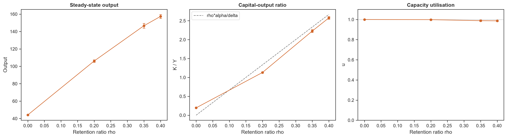

# Endogenous Investment and Capital Accumulation — a Cobb-Douglas Supply Core

## Overview

This repository contains an Agent-Based Model (ABM) built in Python with the
**Mesa** framework. It extends the heterogeneous Keynesian Cross of **Teglio
(2025)** so that **investment drives output *through capital*** — capital
accumulation endogenises the *supply* side.

The economy is single-good, fixed-price (numeraire = 1) and
**stock-flow-consistent** (SFC): money is neither created nor destroyed in
settlement. It is an exploratory computational laboratory for the *qualitative*
macroeconomics of alternative behavioural assumptions, not a calibrated forecast.

Labour is fixed (`L` per firm); there is no labour market yet — that is a later
stage of the project (see *Interpretive frame* and *Roadmap*).

---

## Research direction

> **Can endogenous investment, financed internally by firms, drive output by
> building productive capital in a stock-flow-consistent heterogeneous economy?**

**Answer from this core: yes, via the supply side.** Raising the retention ratio
`rho` from `0` to `0.40` takes the capital stock from a low floor to a large stock
and steady-state output from **~44 to ~157**, with the wage/profit split pinned at
`1-alpha` / `alpha` by construction and the firm cash buffer identically zero. See
*Results*.


---

## Interpretive frame (read this before the results)

This is the honest framing of what the core does and does **not** show:

* **The core is capacity-constrained everywhere** (`u ~ 1` across the whole
  sweep, baseline included).
* **The `rho = 0` baseline is not weak-demand stagnation.** It is a **low-capital**
  economy: with no growth investment, capital settles where `delta·K` equals the
  `investment_floor`, so capacity — and hence output — is low.
* **The headline result is a supply-side result.** Output rises with `rho` because
  capital raises Cobb-Douglas capacity (`Y ~ Y* = A·K^alpha·L^(1-alpha)`), not
  because of a demand multiplier. The **Keynesian demand channel is dormant** in
  this core.
* **The demand calibration is a regime choice, not data.** `c0 = 1.0` and
  `wealth_effect = 0.08` were chosen to place the economy in the
  capacity-constrained regime; they are not empirical estimates.
* **Endogenising demand *as well*** — so that slack becomes involuntary
  unemployment — is the labour-market task (roadmap point 11). This core
  establishes the supply side.

Do not present this core as a demonstration of demand-driven stagnation.

---

## Model

**Production — true Cobb-Douglas, essential capital:**

```text
Y* = A * K**alpha * L**(1 - alpha)          (alpha = 1/3)
Y  = min(demand, Y*)                          (K = 0  =>  Y* = 0)
```

**Distributive coherence — markup tied to alpha:**

```text
markup = alpha / (1 - alpha) = 0.5
wage share   = 1 / (1 + markup) = 1 - alpha = 0.667
profit share = markup / (1 + markup) = alpha = 0.333
```

**Consumption** (worker MPC `c1`, lower capitalist MPC; wealth effect `lambda`):

```text
C = c0 + mpc * income + lambda * wealth       (bounded by money on hand)
```

**Internal financing via retained earnings.** Each period a firm plans
investment from the flow of profit, capped by current profit (no external
credit), with a utilisation accelerator and a floor:

```text
util_effect = max(0, 1 + beta * (u_last - target_utilization))
I_planned   = clip(retention_ratio * profit_last * util_effect, investment_floor, profit)
```

It then **retains exactly what it invests and distributes the rest as dividends**:

```text
retained  = I_planned
dividends = gross_profit - retained
```

The firm cash account (`money_buffer`) is an **intra-period pass-through**: after
paying for delivered investment goods, any residual (from goods-market rationing)
is paid out as dividends and the buffer **returns to zero every period**. There
is no accumulating stock, hence no money sequestration.

**Capital** accumulates with depreciation `delta` and a one-period gestation lag:

```text
K(t+1) = (1 - delta) * K(t) + I_delivered(t)
```

**Conserved quantity (SFC):** `sum(household wealth + income) + sum(firm
money_buffer)` is constant (deviation < 1e-9); at a period boundary the buffer is
zero.

---

## Simulation sequence

Read directly from `src/model.py`. Note that the **investment settlement precedes
household settlement** (step 6 before step 7):

1. households form consumption demand;
2. firms plan investment (profit flow, accelerator on last utilisation);
3. firms register demand (consumption + investment);
4. firms produce `Y = min(demand, Y*)`; the goods market rations;
5. firm accounting: wages, retained (= planned investment), residual dividends;
6. investment settlement: pay for delivered goods, update capital, return the
   residual as dividends so the buffer returns to zero;
7. household settlement: credit income, pay for delivered goods.

---

## Recorded indicators

`Output`, `Potential_Output`, `Output_Gap`, `Total_Capital`, `Money_Buffer`,
`Consumption`, `Investment`, `Average_Utilization`, `Wage_Share`, `Profit_Share`,
`Income_Gini`, `Wealth_Gini` (net worth = money + owned firm's money & capital).

---

## Results

Steady-state sweep over the retention ratio (100 households, 10 firms; means over
**3 seeds**, **2000 steps**, last 50 observations):

| rho  | Y     | u    | K/Y  | I/Y   | wage share | profit share | money buffer |
| ---- | ----- | ---- | ---- | ----- | ---------- | ------------ | ------------ |
| 0.00 | 44.1  | 1.00 | 0.19 | 0.010 | 0.667      | 0.333        | 0.0          |
| 0.20 | 106.1 | 1.00 | 1.13 | 0.057 | 0.667      | 0.333        | 0.0          |
| 0.35 | 146.6 | 0.99 | 2.23 | 0.111 | 0.667      | 0.333        | 0.0          |
| 0.40 | 157.3 | 0.99 | 2.58 | 0.129 | 0.667      | 0.333        | 0.0          |

* `K/Y` tracks the analytical relation `rho*alpha/delta` and `I/Y` tracks
  `rho*alpha` (at `alpha = 1/3`, `delta = 0.05`: `rho = 0.40 => K/Y = 2.67`,
  `I/Y = 0.133`; the small gaps come from `u` slightly below the accelerator
  target with marginal investment rationing).
* Factor shares are exact by construction; the money buffer is identically zero.
* Utilisation is ~1 throughout — the economy is capacity-constrained, so output
  is capacity-determined (`Y ~ Y*`) and rises with capital: the supply channel.



Parameters (`alpha = 1/3`, `retention_ratio`, `delta = 0.05`, `c0 = 1.0`,
`wealth_effect = 0.08`, `investment_floor`, `beta`, `target_utilization = 0.90`)
are standard textbook or chosen-for-regime values, **not yet empirically
anchored**; bibliographic anchoring is a later task.

---

## Repository structure

```text
src/
├── agents.py        Firm (Cobb-Douglas, internal financing), Household, Capitalist
├── model.py         MacroModel: period sequence, settlement, metrics
└── experiment.py    Monte-Carlo runner, confidence bands, retention-ratio sweep
notebooks/
└── 01_Endogenous_Investment.ipynb   Baseline vs. extended + rho sweep + supply channel
tests/
├── conftest.py
└── test_model.py    SFC + buffer==0, factor shares, essential capital, headline (19 tests)
performance/
└── engine.cpp       STALE: additive Phase-1 model, NOT the current core (do not use)
requirements.txt
macro_results.png, retention_sweep.png
```

---

## Getting started

```bash
python -m pip install -r requirements.txt

# reproduce the figures and analysis
jupyter nbconvert --to notebook --execute --inplace notebooks/01_Endogenous_Investment.ipynb

# run the checks (SFC, buffer==0, factor shares, headline result)
python -m pytest tests/ -q
```

Programmatic use:

```python
import sys; sys.path.append("src")
from experiment import run_experiment, summarize, retention_sweep

panel = run_experiment(retention_ratio=0.40, steps=2000, seeds=3)  # multi-seed panel
band  = summarize(panel)                                           # mean + 95% CI per step
sweep = retention_sweep([0.0, 0.20, 0.35, 0.40])                   # steady-state vs rho
```

**C++ engine — not aligned to this core.** `performance/engine.cpp` is an
aggregate second implementation inherited from the additive Phase-1 model. It has
**not** been ported to the Cobb-Douglas core and must not be used for results
until it is (a separate, tracked task).

---

## References

Teglio, A. (2025). *Rationality, inequality, and the output gap: Evidence from a
disaggregated Keynesian Cross diagram.*
<https://link.springer.com/article/10.1007/s11403-024-00412-4>

Mesa: Agent-Based Modeling in Python — <https://mesa.readthedocs.io/>

---

## Disclaimer

An exploratory computational economics model for research and education. It
investigates the qualitative implications of behavioural assumptions within a
heterogeneous framework; it is not a calibrated forecast or a policy
recommendation.
